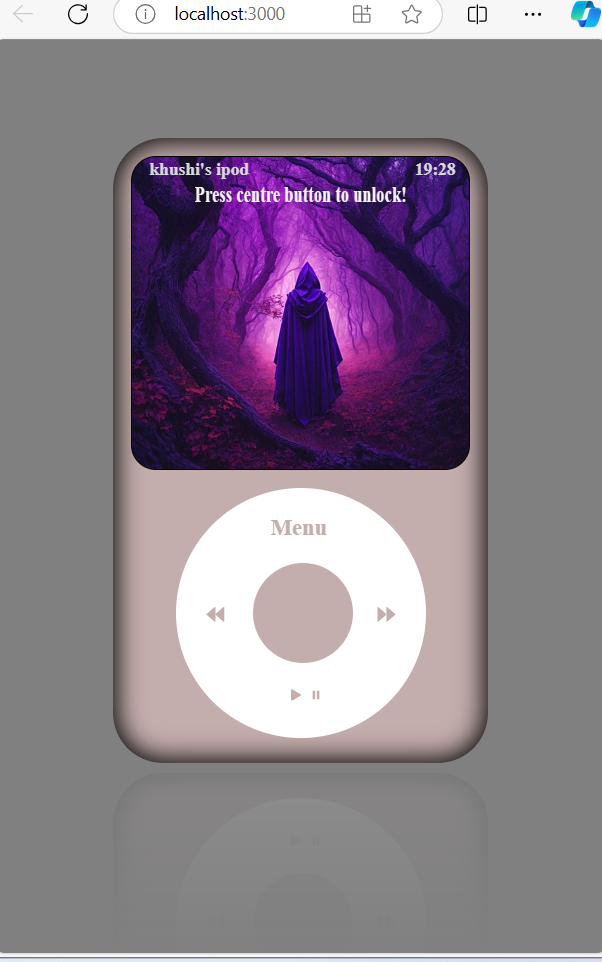

# 𝐌𝐢𝐧𝐢 𝐈𝐩𝐨𝐝 𝐀𝐩𝐩 - 𝐑𝐞𝐚𝐜𝐭𝐉𝐒 🚀

 

## ⭐ Introduction

This is a Mini Ipod App Project which is built using React, CSS, Javascript. It is responsive across all devices.

𝐔𝐬𝐞𝐫 𝐒𝐭𝐨𝐫𝐢𝐞𝐬

- Users should be able to access the features like Settings, Menu, Music, Game in the iPod.
- Users should be able to go back from the particular menu to the main menu on clicking the Menu button and to access the main menu from the home screen using the Menu button.
- Users should be able to go inside the menu by clicking the center button.
- Users should be able to click and hold on the circular menu and move the mouse in a circular fashion inside the menu boundary (white circle is the menu) to navigate in the iPod menu.
- Users should be able to listen to music by selecting “All Songs” inside the Music menu.
- Users should be able to toggle between the themes in settings.
- Users should be able to change the wallpaper of the app in the settings.

𝐅𝐞𝐚𝐭𝐮𝐫𝐞𝐬

- Main Menu - Settings, Music, Now Playing, Games,
- Settings Menu
  - Toggle Theme - Changes the theme of the app
  - Change Wallpaper - Changes the screen wallpaper
- Music Menu
  - All Songs - Plays some Songs
  - Albums - Shows the Album Cover
  - Artists - Shows the Featured Artist
- Now Playing Menu - Displays currently playing
- Games Menu - Shows a Game Display
- Centre Button - Acts as ENTER Button
- Menu Button - To move back/forward in the Menu
- Sliding feature of the rotating pad to access the menu.
   
   

## 🔥 Getting Started With The Project

- Fork the Project in your Repository.
- Clone the Forked Repository in your Local System.
- Run 'npm install'.
- Run 'npm start'.
- Enjoy :)

For any issues related to the project, raise an ISSUE in the respective Repository.
 
 

## 🔨 Tools Used

- Packages:

  - react
  - react-dom
  - react-scripts
  - zingtouch
  - web-vitals

- Library: ReactJS
- Version Control System: Git
- VCS Hosting: GitHub
- Programming / Scripting: JavaScript
- Front-End: HTML, CSS
- Runtime Environment: NodeJS
- Integrated Development Environment: VSCode
   
   

## 🔗 Links

> ## Checkout the Website [Web Application](https://khushichhatwani.github.io/ipod/)

 

## 💻 Screens

 

## 🐦 Follow Me:

> [LinkedIn](https://www.linkedin.com/in/khushi-chhatwani-1b534822a/)

I hope you like the project. Thanks for reading :)

# Getting Started with Create React App

This project was bootstrapped with [Create React App](https://github.com/facebook/create-react-app).

## Available Scripts

In the project directory, you can run:

### `npm start`

Runs the app in the development mode.\
Open [http://localhost:3000](http://localhost:3000) to view it in your browser.

The page will reload when you make changes.\
You may also see any lint errors in the console.

### `npm test`

Launches the test runner in the interactive watch mode.\
See the section about [running tests](https://facebook.github.io/create-react-app/docs/running-tests) for more information.

### `npm run build`

Builds the app for production to the `build` folder.\
It correctly bundles React in production mode and optimizes the build for the best performance.

The build is minified and the filenames include the hashes.\
Your app is ready to be deployed!

See the section about [deployment](https://facebook.github.io/create-react-app/docs/deployment) for more information.

### `npm run eject`

**Note: this is a one-way operation. Once you `eject`, you can't go back!**

If you aren't satisfied with the build tool and configuration choices, you can `eject` at any time. This command will remove the single build dependency from your project.

Instead, it will copy all the configuration files and the transitive dependencies (webpack, Babel, ESLint, etc) right into your project so you have full control over them. All of the commands except `eject` will still work, but they will point to the copied scripts so you can tweak them. At this point you're on your own.

You don't have to ever use `eject`. The curated feature set is suitable for small and middle deployments, and you shouldn't feel obligated to use this feature. However we understand that this tool wouldn't be useful if you couldn't customize it when you are ready for it.

## Learn More

You can learn more in the [Create React App documentation](https://facebook.github.io/create-react-app/docs/getting-started).

To learn React, check out the [React documentation](https://reactjs.org/).

### Code Splitting

This section has moved here: [https://facebook.github.io/create-react-app/docs/code-splitting](https://facebook.github.io/create-react-app/docs/code-splitting)

### Analyzing the Bundle Size

This section has moved here: [https://facebook.github.io/create-react-app/docs/analyzing-the-bundle-size](https://facebook.github.io/create-react-app/docs/analyzing-the-bundle-size)

### Making a Progressive Web App

This section has moved here: [https://facebook.github.io/create-react-app/docs/making-a-progressive-web-app](https://facebook.github.io/create-react-app/docs/making-a-progressive-web-app)

### Advanced Configuration

This section has moved here: [https://facebook.github.io/create-react-app/docs/advanced-configuration](https://facebook.github.io/create-react-app/docs/advanced-configuration)

### Deployment

This section has moved here: [https://facebook.github.io/create-react-app/docs/deployment](https://facebook.github.io/create-react-app/docs/deployment)

### `npm run build` fails to minify

This section has moved here: [https://facebook.github.io/create-react-app/docs/troubleshooting#npm-run-build-fails-to-minify](https://facebook.github.io/create-react-app/docs/troubleshooting#npm-run-build-fails-to-minify)
